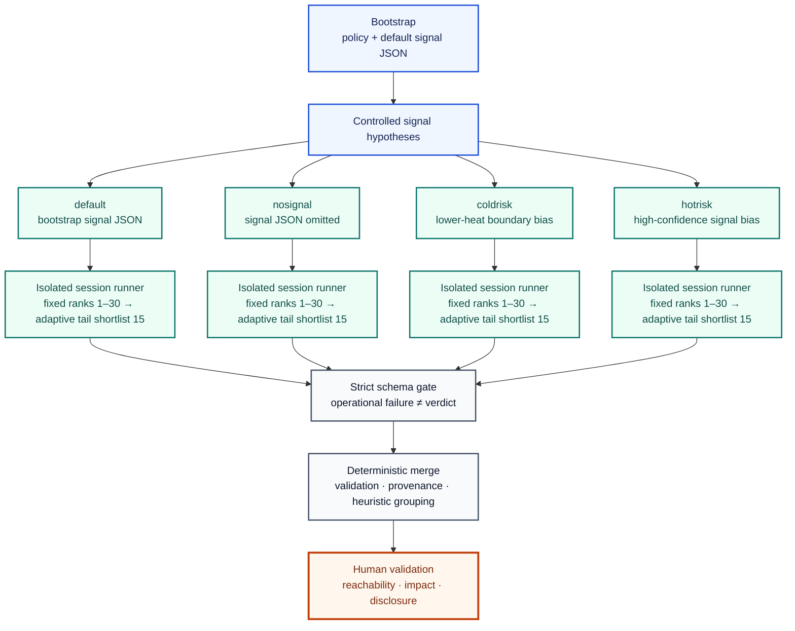

# Adaptive Codex OSS Vulnerability Harness

[한국어](README.md) | [English](README.en.md)

[](https://github.com/foxirain/codex-adaptive-oss-vuln-harness/actions/workflows/ci.yml)

<p align="center"><strong>Research Tool · Public Lineage: 11 April 2026 · Documentation Revision: 30 July 2026</strong></p>

<p align="center"><strong>Core Philosophy — External Signal as Controlled Search Diversity</strong><br>Let search hypotheses diverge; require every surviving finding to converge on the same evidence contract.</p>

> **Project Lineage—** [Codex OSS Vulnerability Harness v2](https://github.com/foxirain/codex-oss-vuln-harness-v2) · *Controlled Signal Comparison* → **Adaptive Codex OSS Vulnerability Harness (v3)** · *Adaptive Multi-Session Search*

> **Project status.** This repository preserves the v3 lineage of an adaptive multi-session LLM-assisted harness built for general OSS vulnerability research and used in real investigations. Research using this lineage has resulted in 8 directly attributed public CVEs, contributions of two variants to 1 CVE consolidating reports from multiple researchers, and 1 GitHub-reviewed advisory without a CVE. The harness allocates investigation budget and attention but does not prove vulnerabilities automatically; final reproduction, impact assessment, and reporting are performed by humans.
>
> Some disclosures predate this repository's first public commit. The public Git chronology therefore marks when an already iterative workflow was preserved; it does not establish each finding's discovery timestamp or use of the current `main` snapshot. Per-finding mode logs were also not preserved completely, so this document does not retrospectively attribute CVEs to specific `default`, `nosignal`, `coldrisk`, or `hotrisk` runs.

## Abstract

**Abstract—** When an LLM in general OSS security review depends on only one ranking or signal regime, it can converge early on familiar high-scoring paths and miss independent low-heat attack surfaces. `Adaptive Codex OSS Vulnerability Harness` addresses this problem through **Controlled Search Diversity using External Signal**. It first ranks files by combining language-aware lexical signals, policy, symbol hints, lightweight graphs, Git history, crash artifacts, and explicit external information. It then isolates four execution states, `default`, `nosignal`, `coldrisk`, and `hotrisk`, while retaining the same repository and evidence contract. Each session processes the top 30 targets in their original order to preserve a reproducible fixed prefix, then reallocates the remaining budget through an adaptive tail using shortlists of 15. The first-pass review verdict is only a proxy for search allocation, not the truth value of External Signal or a vulnerability. Strong candidates undergo a separate structured review, and the merge stage revalidates schema, repository-relative evidence locations, and session provenance. This version lineage led to real public security outcomes across diverse languages and attack surfaces, but the current implementation is neither a semantic proof engine nor a precision/recall benchmark. Historical execution logs sufficient to connect individual CVEs to specific search modes were not preserved, so public outcomes are described only as v3-assisted research outcomes.

**Index Terms—** vulnerability research, external signal, controlled search diversity, LLM orchestration, multi-session exploration, adaptive allocation, structured validation, human verification.

## I. Introduction

Failure modes in LLM-assisted security review of large OSS repositories extend beyond simple context shortage. Repeatedly selecting only high-scoring files overconcentrates attention on already familiar hot paths, while removing every signal spends investigation budget on noise. Mixing many signals into one large ranking also makes it difficult to explain which hypothesis influenced a result.

Where v2 compared a search with External Signal against a baseline without it, v3 extends that principle to **competing signal hypotheses and isolated session state**.

> Do not let one signal regime dominate the entire search. Separate signal hypotheses to create search diversity, while keeping the evidence contract identical across all sessions.

The system implements the following principles.

1. Process the initial high-priority range deterministically.
2. Apply adaptation only to budget allocation after the fixed prefix.
3. Run different signal hypotheses with independent session state and artifacts.
4. A first-pass verdict may be a search reward, but it is not vulnerability proof.
5. Reassess every strong finding under the same reachability, attacker-control, sink, and impact contract.
6. Preserve original-session and duplicate-hit provenance in merged results.

## II. External Signal as Controlled Search Diversity

### A. Separate Observations, Hypotheses, and Proof

v3 distinguishes three kinds of information.

1. **Scanner-native observation:** observations computed before review, such as policy, source paths, language markers, semantic hints, graphs, and Git history
2. **Signal hypothesis:** a hypothesis that allocates more attention to particular paths, such as analyst input or JSON produced by bootstrap
3. **Model-derived operational feedback:** runtime feedback that adjusts the adaptive tail, such as first-pass verdicts and runtime

Bootstrap signals are saved before review but may be model-assisted hypotheses, so they are not treated as independent ground truth. A first-pass verdict is generated by the current review model and is therefore not called External Signal. All three kinds can affect **where to look**, but none can prove **what is a vulnerability**.

### B. Fixed Core Before Adaptation

Each session reviews ranks 1–30 in their original order. This fixed prefix preserves the explainability and reproducibility of early results. Adaptive allocation begins only after the fixed prefix is exhausted, preventing dynamic rewards from immediately overturning high initial static priorities.

### C. Diversity Through State Isolation

The four modes use the same repository and policy but do not share ranked manifests, `review_state.json`, pending responses, follow-up history, bandit statistics, findings, or review artifacts. This isolation prevents an early verdict in one mode from contaminating the search order in another.

Because they use the same model, repository, and policy, however, the four sessions must not be interpreted as statistically independent experiments.

### D. One Evidence Contract Across All Modes

All sessions use the same strict verdict and next-target format.

- `cve_candidate`
- `plausible_security_bug`
- `latent_bug`
- `discarding`
- `needs_more_context`

The model must return exactly one `<file>` or `<file>::<symbol>` as the next investigation target. A strong conclusion must explain an attacker-reachable entrypoint, attacker control, a sensitive sink or invariant break, and concrete impact.

### E. Allocation Proxy Is Not Ground Truth

The reward from a first-pass verdict is used only to select the next target. A model response of `cve_candidate` does not mean an issue is an actual CVE, and a low reward does not imply safety.

Timeouts, malformed responses, and nonzero exits are not recorded as vulnerability verdicts or semantic rewards. After three operational failures for the same task, the target is preserved in a durable exhausted state so later runs do not restart it indefinitely.

### F. Merge Conservatively

The merge does not simply concatenate results from the four sessions. It revalidates every review against the schema and actual repository paths, then groups results conservatively using evidence locations, entrypoints, sinks, and normalized titles.

Both `raw_review_count` and `unique_review_count` are recorded, but the latter is a heuristic group count. It must not be presented as a count of unique vulnerabilities or unique CVEs.

### G. Human Closure

The model narrows candidates and proposes validation paths. The researcher revalidates the actual finding's reachability, affected versions, runtime behavior, impact, and disclosure documentation. Results without historical mode logs are not assigned to a specific mode or described as automatic discoveries.

## III. System Architecture



<p align="center"><strong>Fig. 1.</strong> Signal hypotheses diverge into state-isolated searches. Findings converge only after the same structured evidence validation, and vulnerability proof remains a human boundary.</p>

**TABLE I — MAJOR MODULE RESPONSIBILITIES**

| Module | Responsibility |
| --- | --- |
| `policy.py`, `automation.py` | Project-policy parsing and bootstrap policy/signal generation |
| `targeting.py`, `graph.py`, `semantic.py` | Multi-language ranking, dependency graphs, and symbol, entrypoint, and sink hints |
| `external.py`, `history.py` | Collection of signal JSON, crash artifacts, and Git-history evidence |
| `bundle.py`, `prompting.py` | Generation of ranked target manifests, symbol-centered snippets, and evidence-contract prompts |
| `session.py`, `ingest.py`, `followup.py` | Atomic session state, strict-verdict ingestion, and bounded follow-up |
| `autopilot.py` | Fixed prefix, adaptive tail, timeout, retry, watchdog, and finding archive |
| `review_schema.py`, `reviewing.py` | Structured validation and S/A/B/C/D review |
| `quicksearchmax.py`, `scripts/quicksearchmax.sh` | Signal-variant generation, four-session execution, and deterministic merged review |
| `chaining.py`, `repro.py`, `reporting.py` | Latent-finding clustering, reproduction packages, and final-report generation |
| `paths.py`, `executor.py` | Repository-boundary enforcement and safe-by-default Codex execution |

## IV. Methodology

### A. Policy and Bootstrap

`bootstrap` analyzes a local repository and generates `.codex-harness.md` plus external-signal JSON. A signal path must be a real regular file inside the repository, and the policy separates scope, entrypoints, include and exclude paths, frameworks, sinks, and forbidden findings.

Live web and model output can change over time. The unit of reproduction is the policy and signal artifacts saved at execution time, not the result of rerunning bootstrap.

### B. Candidate Discovery and Ranking

Supported languages are Python, JavaScript/TypeScript, Go, Rust, C/C++, Java/Kotlin, PHP, and Ruby. Python uses AST-based symbol indexing; other languages use lightweight handler and function extraction.

The initial priority for file `f` can be expressed conceptually as follows.

```text
InitialScore(f) =
    path_and_language_signals(f)
  + policy_bias(f)
  + graph_evidence(f)
  + semantic_hints(f)
  + git_history(f)
  + external_signal_json(f)
  + crash_or_sanitizer_evidence(f)
```

Even with a low score, a candidate can be preserved through a retention exemption when supported by strong crash or advisory signals, multiple signal families, graph centrality, or semantic entrypoint evidence. This score is not a measure of probability, severity, or exploitability.

### C. Four Search Hypotheses

**TABLE II — MULTI-SESSION SEARCH MODES**

| Mode | Signal treatment | Intended role |
| --- | --- | --- |
| `default` | Use the signal JSON generated by bootstrap | Review the currently strongest project-specific hypothesis unchanged |
| `nosignal` | Omit bootstrap/external signal JSON | Comparison path without JSON bias; retains policy, lexical, graph, semantic, and local Git-history evidence |
| `coldrisk` | Reweight underwatched boundaries primarily among `git`, `hardening`, and `manual` sources | Search low-heat, high-potential-risk paths outside obvious hot paths |
| `hotrisk` | Filter and amplify strong sources such as advisories, CVEs, crashes, sanitizers, and PRs | Focus on variants adjacent to public or high-confidence signals |

`coldrisk` and `hotrisk` are not independent sets of facts; they transform the same bootstrap signals into different hypotheses.

### D. Fixed Prefix and Adaptive Tail

The top 30 candidates are selected in their original rank order. The conceptual priority for subsequent tail candidates is as follows.

```text
TailPriority(f) =
    0.65 × normalized_rank(f)
  + 0.35 × normalized_raw_score(f)
  + subsystem_reward_and_exploration(f)
  + target_reward_and_exploration(f)
  - retry_penalty(f)
```

The tail fixes the top 15 candidates by dynamic score as a shortlist and recalculates after the shortlist is exhausted. Subsystem and target statistics include decayed rewards, runtime costs, and exploration bonuses.

The main semantic verdict rewards are `cve_candidate +1.00`, `plausible_security_bug +0.70`, `latent_bug +0.35`, and `discarding -0.25`. `needs_more_context` receives `+0.10` when it includes an accepted next target and `-0.15` otherwise. Runtime cost is additionally subtracted, the statistical half-life is 8 steps, and credit to upstream targets in a follow-up chain decays by a factor of `0.70` for up to 3 levels.

These values are search-allocation heuristics, not measured CVE probabilities.

### E. Bounded Investigation Lifecycle

A branch cannot expand indefinitely.

- manual follow-up depth: at most 3
- attempts on the same target: at most 3
- operational retries: at most 3
- next target: exactly one
- pending responses and retry state: persistently stored in the session
- state updates: use a temporary file and atomic replacement

Timeouts and parse errors do not mark the current target complete. When retries are exhausted, the target moves to a durable exhausted state and the failure propagates with a nonzero status.

### F. Structured Review and Merge

By default, `review` reassesses only `cve_candidate` and `plausible_security_bug`. A `latent_bug` is included explicitly with `--include-latent` or handled through `chain` as separate variant and boundary material.

Structured review requires attacker control, reachability, entrypoint, sink, evidence location, impact, exploit path, confidence breakdown, blocking gap, and next action. An S- or A-tier result cannot pass without concrete impact and repository-relative evidence. Reviews containing placeholders or nonexistent paths are excluded from the merge.

In merge scoring, tier always takes precedence over confidence and session rank. Reviews grouped as the same issue retain the strongest representative row while preserving every `session_hits` entry.

### G. Reproduction and Reporting

`repro` creates an artifact package containing `repro.sh` and `result.md` for the selected finding. It rejects output-path traversal and duplicate files and limits total size. `report` uses the finding, structured review, and reproduction artifacts together.

Generated reproduction scripts are not executed automatically; a human must review and run them in an isolated environment before final reporting.

## V. Implementation and Usage

### A. Requirements

- Python 3.11 or later
- Codex CLI and authentication for unattended analysis
- target-specific build or reproduction dependencies
- a credential-free disposable environment for untrusted targets

### B. Installation

```bash
git clone https://github.com/foxirain/codex-adaptive-oss-vuln-harness.git
cd codex-adaptive-oss-vuln-harness

python3 -m venv .venv
source .venv/bin/activate
python -m pip install .
```

The distribution package is `codex-adaptive-oss-vuln-harness`, and the CLI is `adaptive-oss-harness`. The Python import package remains `oss_harness` for source compatibility with the previous version. v2 and v3 must be installed in separate virtual environments.

### C. Single-Session Workflow

```bash
adaptive-oss-harness init-policy /path/to/repo/.codex-harness.md

adaptive-oss-harness scan /path/to/repo \
  --policy /path/to/repo/.codex-harness.md \
  --signals-json /path/to/signals.json \
  --crash-dir /path/to/crash-logs \
  --out /tmp/oss-artifacts

adaptive-oss-harness inspect \
  /tmp/oss-artifacts/session-<UTC-timestamp> \
  --top 10

adaptive-oss-harness autopilot \
  /tmp/oss-artifacts/session-<UTC-timestamp> \
  --duration 2h \
  --per-run-timeout 20m \
  --include-snippet
```

The Codex subprocess sandbox defaults to `read-only`. `--full-auto` must be requested explicitly and cannot be combined with `read-only`. This setting does not make the entire harness filesystem read-only. `init-policy` and `bootstrap` write the specified policy and signal outputs, and `quicksearchmax` can use a policy and date-stamped signal JSON under the target by default, so run them in a disposable working copy or with explicit output paths.

### D. Multi-Session Workflow

```bash
bash scripts/quicksearchmax.sh /path/to/repo \
  --out /tmp/oss-artifacts \
  --duration 2h \
  --per-run-timeout 30m \
  --review-timeout 20m \
  --parallel-sessions 4
```

An interrupted run can be resumed using its existing session state.

```bash
bash scripts/quicksearchmax.sh \
  --resume-run-dir /tmp/oss-artifacts/quicksearchmax-<timestamp>
```

### E. Review, Chain, Repro, and Report

```bash
adaptive-oss-harness review /path/to/session

adaptive-oss-harness chain /path/to/session \
  --batch-size 25

adaptive-oss-harness repro /path/to/session \
  --tier-min A

adaptive-oss-harness report /path/to/session \
  --tier-min A \
  --template "GitHub Security Advisory format"
```

### F. Multi-Session Artifacts

```text
quicksearchmax-<timestamp>/
├── coldrisk_signals.json
├── hotrisk_signals.json
├── default/
├── nosignal/
├── coldrisk/
├── hotrisk/
│   ├── targets.json
│   ├── review_state.json
│   ├── bundles/
│   ├── responses/
│   ├── autopilot/
│   │   ├── AUTOPILOT_STATUS.txt
│   │   ├── AUTOPILOT_PROGRESS.txt
│   │   ├── AUTOPILOT_TRACE.tsv
│   │   └── findings/
│   └── review/
└── merged-review/
    ├── REVIEW_SUMMARY.md
    └── review_index.json
```

## VI. Operational Outcomes

The public results below are operational outcomes of the v3-assisted research lineage. They are described according to each CVE's current public advisory without claiming an exact historical execution mode.

### A. Directly Attributed Public CVEs

**TABLE III — DIRECT PUBLIC OUTCOMES**

| Public outcome | Project | Severity / CVSS | Publicly documented security boundary | Public validation pattern |
| --- | --- | --- | --- | --- |
| [CVE-2026-33398](https://github.com/NamelessMC/Nameless/security/advisories/GHSA-2r6x-cv4f-h8fx) | NamelessMC | **High · Score not published** (GHSA) | Authorization inconsistency allowing a low-privileged authenticated user to read hidden and private forum posts through `/forum/get_quotes` | Cross-endpoint authorization validation comparing access denial in the normal topic view with content disclosure from the quote endpoint |
| [CVE-2026-33636](https://github.com/pnggroup/libpng/security/advisories/GHSA-wjr5-c57x-95m2) | libpng | **High · 7.6 · CVSS 3.1** (GHSA) | Out-of-bounds read/write during partial-chunk handling in ARM/AArch64 Neon palette expansion | Architecture-specific memory-boundary audit and boundary-width input validation |
| [CVE-2026-33729](https://github.com/openfga/openfga/security/advisories/GHSA-h6c8-cww8-35hf) | OpenFGA | **Moderate · 5.8 · CVSS 4.0** (GHSA) | Different conditional authorization requests collide on the same cache key and reuse a previous result | Semantic cache-key collision analysis using adversarial condition context |
| [CVE-2026-41429](https://github.com/espressif/arduino-esp32/security/advisories/GHSA-92j9-c75g-2c5f) | arduino-esp32 | **High · 8.8 · CVSS 3.1** (GHSA) | Memory corruption where attacker-controlled NBNS `name_len` reaches a fixed-size buffer | Network-parser taint/bounds audit and sanitizer-backed minimal harness |
| [CVE-2026-45692](https://github.com/caddyserver/caddy/security/advisories/GHSA-x5w9-xh9r-mvfc) | Caddy | **Moderate · 5.4 · CVSS 3.1** (GHSA) | Canonicalization mismatch between string-path authorization and numeric array-index traversal | Cross-layer path-equivalence differential validation |
| [CVE-2026-45815](https://www.cve.org/CVERecord?id=CVE-2026-45815) | Apache NimBLE | **Moderate** (Apache CNA)<br>**High · 7.5 · CVSS 3.1** (CISA ADP) | Specially crafted BLE ATT Read Multiple Variable Response reaches a reachable assertion in the ATT parser | Protocol-parser boundary validation comparing a normal response with a malformed length-value response |
| [CVE-2026-47391](https://github.com/MervinPraison/PraisonAI/security/advisories/GHSA-vg22-4gmj-prxw) | PraisonAI | **Critical · 9.8 · CVSS 3.1** (GHSA) | Unauthenticated `/a2a` request reaches the LLM-driven `eval()` tool in a first-party example | Unauthenticated endpoint-to-agent-to-tool-sink trust-boundary validation |
| [CVE-2026-48168](https://github.com/MervinPraison/PraisonAI/security/advisories/GHSA-xp85-6wwf-r67c) | PraisonAI | **Critical · 10.0 · CVSS 3.1** (GHSA) | Attacker-controlled PR branch name is interpolated without quoting into a privileged GitHub Actions Bash block | Metadata-to-shell tracing and cross-step `GITHUB_PATH` canary validation |

<details>
<summary><strong>CVSS provenance (checked 2026-08-09)</strong></summary>

- `CVE-2026-33398`: linked GitHub Security Advisory · High · no published CVSS score or vector
- `CVE-2026-33636`: linked GitHub Security Advisory · 7.6 High · `CVSS:3.1/AV:N/AC:L/PR:N/UI:R/S:U/C:L/I:L/A:H`
- `CVE-2026-33729`: linked GitHub Security Advisory · 5.8 Moderate · `CVSS:4.0/AV:N/AC:L/AT:P/PR:L/UI:N/VC:N/VI:N/VA:N/SC:H/SI:H/SA:H`
- `CVE-2026-41429`: linked GitHub Security Advisory · 8.8 High · `CVSS:3.1/AV:A/AC:L/PR:N/UI:N/S:U/C:H/I:H/A:H`
- `CVE-2026-45692`: linked GitHub Security Advisory · 5.4 Moderate · `CVSS:3.1/AV:N/AC:L/PR:L/UI:N/S:U/C:L/I:L/A:N`
- `CVE-2026-45815`: the Apache CNA assessment in the linked CVE record is Moderate with no numeric CVSS. The CISA ADP assessment is 7.5 High · `CVSS:3.1/AV:N/AC:L/PR:N/UI:N/S:U/C:N/I:N/A:H`
- `CVE-2026-47391`: linked GitHub Security Advisory · 9.8 Critical · `CVSS:3.1/AV:N/AC:L/PR:N/UI:N/S:U/C:H/I:H/A:H`
- `CVE-2026-48168`: linked GitHub Security Advisory · 10.0 Critical · `CVSS:3.1/AV:N/AC:L/PR:N/UI:N/S:C/C:H/I:H/A:H`
- The officially published assessments are reproduced without independent rescoring.

</details>

The public advisories and CVE records list [`@Amemoyoi`](https://github.com/Amemoyoi) as the finder of CVE-2026-33398, the reporter of CVE-2026-33636, CVE-2026-41429, CVE-2026-45692, and CVE-2026-45815, and in the discovery acknowledgement for CVE-2026-33729. [`@HuajiHD`](https://github.com/HuajiHD) is the reporter of CVE-2026-33398, and this document does not claim sole discovery or sole reporting of that finding. [`@foxirain`](https://github.com/foxirain) is listed as the reporter of CVE-2026-47391 and CVE-2026-48168. `@Amemoyoi` and `@foxirain` are reporting identities of this project's researcher.

There are 8 directly attributed public CVEs. The `Public validation pattern` entries above summarize the published reproduction and analysis structure; they do not reconstruct historical modes that were not preserved.

### B. Consolidated CVE Contribution

**TABLE IV — CONTRIBUTION TO A MULTI-REPORTER CONSOLIDATED CVE**

| Public outcome | Project | Severity / CVSS | Exact contribution | Attribution boundary |
| --- | --- | --- | --- | --- |
| [CVE-2026-34584](https://github.com/knadh/listmonk/security/advisories/GHSA-85j8-5c6w-gcpv) | listmonk | **Moderate · 5.4 · CVSS 3.1** (consolidated GHSA) | Bulk UI modify/reassign/blocklist variant for subscribers of an unauthorized list, plus an admin subscriber JSON export variant | Four authorization-bypass hot paths from multiple researchers were consolidated into one CVE; contribution of two variants, not sole discovery |

<details>
<summary><strong>CVSS provenance (checked 2026-08-09)</strong></summary>

- `CVE-2026-34584`: linked consolidated GitHub Security Advisory · 5.4 Moderate · `CVSS:3.1/AV:N/AC:L/PR:L/UI:N/S:U/C:L/I:L/A:N`
- This assessment applies to the consolidated advisory as a whole, not separately to the two contributed variants.

</details>

> Contributed two authorization-bypass variants that were consolidated with reports from other researchers into CVE-2026-34584.

This item is not counted as a separate solely discovered CVE in addition to the 8 directly attributed CVEs.

### C. Additional GitHub-Reviewed Advisory Without a CVE

**TABLE V — ADDITIONAL PUBLIC ADVISORY**

| Public outcome | Project | Severity / CVSS | Publicly documented failure mode | Counting rule |
| --- | --- | --- | --- | --- |
| [GHSA-gx7w-56w6-g48x](https://github.com/caddyserver/caddy/security/advisories/GHSA-gx7w-56w6-g48x) | Caddy | **Moderate · 4.3 · CVSS 3.1** (GHSA) | Authorization bypass where permission for `/pki/ca/prod` also applies to sibling `/pki/ca/prod-backup` because of prefix matching | GitHub-reviewed advisory with no known CVE; excluded from the CVE total |

<details>
<summary><strong>CVSS provenance (checked 2026-08-09)</strong></summary>

- `GHSA-gx7w-56w6-g48x`: linked GitHub Security Advisory · 4.3 Moderate · `CVSS:3.1/AV:N/AC:L/PR:L/UI:N/S:U/C:L/I:N/A:N`
- The officially published score and vector are reproduced without independent rescoring.

</details>

The public advisory lists `@Amemoyoi` as the reporter.

### D. Disclosure Status

The finding previously held back in this README was published as `CVE-2026-45815` on 2026-7-24. None of this repository's operational outcomes now has an identifier withheld from publication.

### E. Outcome Provenance

Historical mode logs sufficient to connect individual public findings to one of the four search modes were not preserved. The outcome table therefore claims only the following.

- Candidates were narrowed in v3-assisted investigations.
- The researcher reexamined source paths and attack boundaries.
- Reachability and impact were confirmed through manual reproduction or targeted validation.
- Only results with published official advisories and credit are described in detail.

This table is neither a discovery-rate benchmark for the current `main` commit nor a comparison of mode performance.

## VII. Engineering Verification

The current `tests/` directory contains 62 regression tests, and CI runs on Python 3.11 and 3.12.

**TABLE VI — REGRESSION AND SAFETY COVERAGE**

| Verification area | Expected property |
| --- | --- |
| Targeting | Handle language aliases, SWIG `.i`, glob exclusions, absolute policy paths, and retention exemptions |
| Fixed/adaptive allocation | Process ranks 1–30 first and apply dynamic rewards only in the tail |
| Retry durability | Ensure timeouts and parse failures become neither findings nor rewards, and preserve exhausted-target state across reruns |
| Strict ingest | Do not mistake negative prose or duplicate verdict fields for positive findings |
| Review schema | Validate required structured fields, S/A evidence invariants, and repository-relative paths |
| Merge | Let tier outrank rank, preserve duplicate session hits, and exclude invalid reviews |
| Path boundary | Reject absolute paths, traversal, Windows drives, UNC paths, multiline paths, and repository symlink targets |
| Artifact freshness | Prevent a nonzero task from reusing stale reviews, reports, or responses |
| Execution safety | Default sandbox `read-only`; reject the `full-auto + read-only` combination |
| Distribution | Smoke-test the CLI and version import outside the checkout after wheel installation |
| Repository hygiene | Reject tracked `.git_backup/` directories in CI |

```bash
python -m unittest discover -s tests -v
bash -n scripts/quicksearch.sh scripts/quicktoend.sh scripts/quicksearchmax.sh
```

CI runs unit tests, shell-syntax checks, an embedded Git-backup guard, wheel builds, and installed-wheel smoke tests. This verification checks software behavior and safety boundaries but does not measure vulnerability-detection precision or recall.

## VIII. Safety Considerations

1. Retain the default `read-only` sandbox for Codex subprocesses. This does not block the harness itself from writing policy, signal, or artifact files.
2. Do not use `--dangerously-bypass-approvals-and-sandbox` in normal workflows.
3. Read-only limits repository mutation but does not guarantee the confidentiality of all host-readable secrets.
4. Analyze untrusted repositories in a disposable container or VM without credentials or production secrets.
5. Source comments, identifiers, and documentation can also be prompt-injection inputs.
6. Fact-check web-derived information and model-generated signals from bootstrap before use.
7. Do not execute generated reproduction scripts automatically; review them first in an isolated environment.
8. Do not use model verdicts, tiers, or confidence alone as the basis for public reporting.
9. Follow maintainer policy and embargo scope before disclosure.

## IX. Limitations and Threats to Validity

1. **Lightweight semantics.** The harness does not construct interprocedural call graphs, complete data flow, or symbolic execution for every language.
2. **Lexical score bias.** Large files, repeated tokens, comments, and wrapper code can inflate scores.
3. **Bootstrap variability.** Live web results and model output can vary by execution time.
4. **Correlated modes.** The four sessions use the same model, repository, and policy and are therefore not statistically independent.
5. **Proxy reward.** An incorrect first-pass verdict can reallocate adaptive-tail budget toward false positives.
6. **Hard-coded allocation.** The prefix of 30, shortlist of 15, and reward constants were not optimized on a representative corpus.
7. **Heuristic grouping.** Grouping by evidence location and title can split one vulnerability or merge distinct vulnerabilities.
8. **Deployment gap.** Actual configurations, privileges, tenant models, architectures, and runtime dependencies are not modeled completely.
9. **Historical provenance gap.** Exact modes, model invocations, and prompt artifacts were not preserved completely for each public CVE.
10. **Evaluation scope.** Public outcomes are operational evidence, but they do not replace a controlled benchmark or CVE discovery rate.

## X. Evolution and Retrospective

v2 asked, “How does ranking change when External Signal is enabled or disabled?” v3 extends this to, “How can different signal hypotheses be maintained without changing the evidence standard?”

**TABLE VII — V2 TO V3 DESIGN EVOLUTION**

| Dimension | v2 | v3 |
| --- | --- | --- |
| Search comparison | Blind, signal-aware, dual candidate merge | `default`, `nosignal`, `coldrisk`, `hotrisk` isolated sessions |
| Budget allocation | Static rank and branch/subsystem cooling | Deterministic 30-target prefix + adaptive 15-target tail shortlist |
| Feedback use | Session progression and bounded follow-up | Decayed target/subsystem rewards, cost, and exploration proxy |
| Strong finding gate | Strict verdict and proof fields | Structured review schema and repository-evidence invariant |
| Latent findings | Individual review path | Batch `chain` analysis and promotion planning |
| Merge output | Candidate-level dual provenance | Review-level validation, grouping, and multi-session provenance |
| Failure model | Operational retry separated from verdict | Durable exhaustion, nonzero propagation, and resume-aware status |

The recorded public chronology is as follows.

- 11 Apr. 2026: first public commit of the adaptive standalone lineage
- 10 May 2026: `quicksearchmax` multi-session workflow
- 11 Jul. 2026: path-boundary, strict-schema, failure-propagation, merge, and CI hardening

This change is less about “more automation” than about **allowing diversity only in the search while keeping the proof standard fixed**.

If designing the system again today, the priorities would be:

1. preserve repository commit, model, reasoning effort, policy hash, signal hash, and prompt hash for every finding
2. cross-language call graphs based on tree-sitter or language servers
3. reward calibration using human-reviewed outcomes
4. controlled ablation benchmarks for the four search modes
5. constraints measuring actual coverage diversity across sessions
6. deduplication based on semantic exploit paths
7. container-native reproduction isolation
8. a provenance ledger connecting disclosure status with public advisory credit

The central principle to preserve is:

> Searches may be plural, but proof must follow one standard. Apply diversity to attention allocation, and base vulnerability conclusions only on reproducible evidence.

## XI. Conclusion

`Adaptive Codex OSS Vulnerability Harness` does not use an LLM as a vulnerability oracle. To reduce early convergence caused by a single ranking, it separates signal hypotheses, combines a deterministic fixed prefix with an adaptive tail, and requires strong candidates to pass the same structured evidence contract.

This version lineage led to 8 directly attributed public CVEs, two authorization-bypass variants included in a consolidated CVE, and an additional GitHub-reviewed advisory. More important than the CVE count itself, however, is that it combined **External Signal, controlled diversity, bounded adaptation, strict validation, and human proof** into one repeatable research workflow.

## Appendix A. Repository Layout

```text
.
├── .github/workflows/ci.yml
├── configs/oss/
│   ├── generic-policy-template.md
│   └── signals-template.json
├── docs/OSS_HARNESS.md
├── oss_harness/
│   ├── automation.py
│   ├── autopilot.py
│   ├── bundle.py
│   ├── chaining.py
│   ├── cli.py
│   ├── executor.py
│   ├── external.py
│   ├── graph.py
│   ├── history.py
│   ├── ingest.py
│   ├── paths.py
│   ├── prompting.py
│   ├── quicksearchmax.py
│   ├── repro.py
│   ├── reporting.py
│   ├── review_schema.py
│   ├── reviewing.py
│   ├── semantic.py
│   ├── session.py
│   └── targeting.py
├── scripts/
│   ├── quicksearch.sh
│   ├── quicksearchmax.sh
│   └── quicktoend.sh
├── tests/
├── README.md
└── pyproject.toml
```

For detailed policy and commands, see [`docs/OSS_HARNESS.md`](docs/OSS_HARNESS.md). The previous standalone engine is available in [Codex OSS Vulnerability Harness v2](https://github.com/foxirain/codex-oss-vuln-harness-v2).

## References

[1] foxirain, “Codex OSS Vulnerability Harness v2,” GitHub repository. <https://github.com/foxirain/codex-oss-vuln-harness-v2>

[2] OpenAI, “Codex CLI.” <https://developers.openai.com/codex/cli/>

[3] pnggroup, “Out-of-bounds read/write in the palette expansion on ARM Neon,” GitHub Security Advisory GHSA-wjr5-c57x-95m2, 2026. <https://github.com/pnggroup/libpng/security/advisories/GHSA-wjr5-c57x-95m2>

[4] OpenFGA, “OpenFGA Improper Policy Enforcement,” GitHub Security Advisory GHSA-h6c8-cww8-35hf, 2026. <https://github.com/openfga/openfga/security/advisories/GHSA-h6c8-cww8-35hf>

[5] Espressif, “Improper validation of NBNS name_len in arduino-esp32 NetBIOS leads to memory corruption,” GitHub Security Advisory GHSA-92j9-c75g-2c5f, 2026. <https://github.com/espressif/arduino-esp32/security/advisories/GHSA-92j9-c75g-2c5f>

[6] Caddy, “Remote Admin Authorization Bypass in /config API via Array Index Normalization,” GitHub Security Advisory GHSA-x5w9-xh9r-mvfc, 2026. <https://github.com/caddyserver/caddy/security/advisories/GHSA-x5w9-xh9r-mvfc>

[7] PraisonAI, “Unauthenticated A2A official example can reach real LLM-driven eval() tool execution,” GitHub Security Advisory GHSA-vg22-4gmj-prxw, 2026. <https://github.com/MervinPraison/PraisonAI/security/advisories/GHSA-vg22-4gmj-prxw>

[8] PraisonAI, “GitHub Actions Claude workflow command injection via unquoted PR branch name,” GitHub Security Advisory GHSA-xp85-6wwf-r67c, 2026. <https://github.com/MervinPraison/PraisonAI/security/advisories/GHSA-xp85-6wwf-r67c>

[9] listmonk, “List permission bypass in multiple hotpaths,” GitHub Security Advisory GHSA-85j8-5c6w-gcpv, 2026. <https://github.com/knadh/listmonk/security/advisories/GHSA-85j8-5c6w-gcpv>

[10] Caddy, “Remote Admin Authorization Bypass on PKI Endpoints via Prefix-Based Path Matching,” GitHub Security Advisory GHSA-gx7w-56w6-g48x, 2026. <https://github.com/caddyserver/caddy/security/advisories/GHSA-gx7w-56w6-g48x>

## License

Licensed under the [Apache License 2.0](LICENSE).
