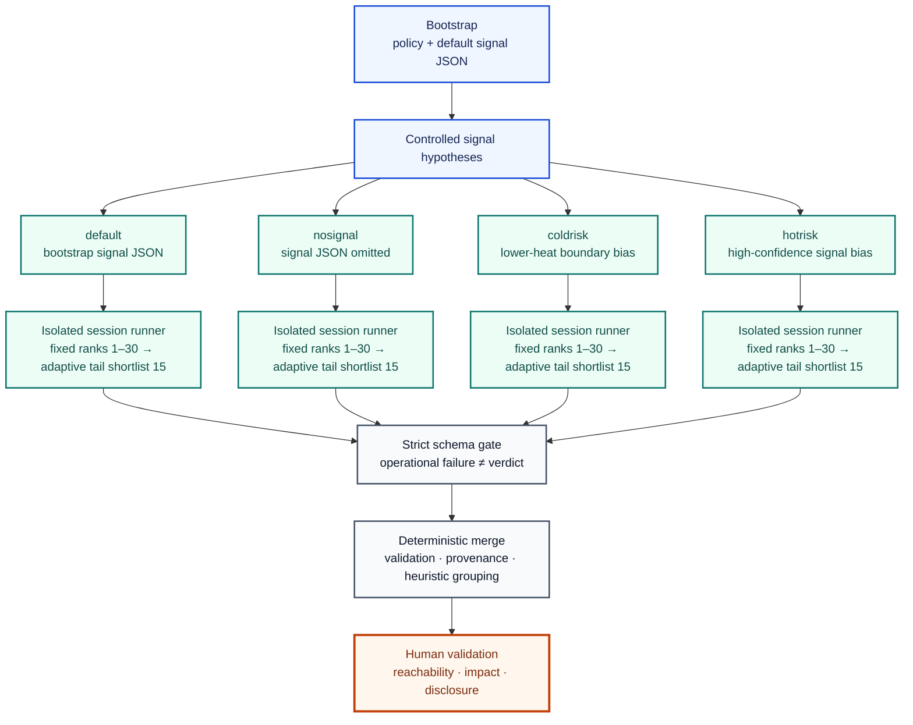

# Adaptive Codex OSS Vulnerability Harness

[](https://github.com/foxirain/codex-adaptive-oss-vuln-harness/actions/workflows/ci.yml)

<p align="center"><strong>Research Tool · Public Lineage: 11 April 2026 · Documentation Revision: 30 July 2026</strong></p>

<p align="center"><strong>Core Philosophy — External Signal as Controlled Search Diversity</strong><br>Let search hypotheses diverge; require every surviving finding to converge on the same evidence contract.</p>

> **Project Lineage—** [Codex OSS Vulnerability Harness v2](https://github.com/foxirain/codex-oss-vuln-harness-v2) · *Controlled Signal Comparison* → **Adaptive Codex OSS Vulnerability Harness (v3)** · *Adaptive Multi-Session Search*

> **Project status.** 이 저장소는 범용 OSS 취약점 조사를 위해 구축하고 실제 연구에 사용한 adaptive multi-session LLM-assisted harness의 v3 lineage를 보존한다. 이 계열을 사용한 조사 결과로 직접 귀속된 공개 CVE 8건, 여러 연구자의 보고가 통합된 CVE 1건에 대한 두 variant 기여, CVE가 부여되지 않은 GitHub-reviewed advisory 1건이 공개됐다. 하네스는 조사 예산과 attention을 배분하지만 취약점을 자동으로 증명하지 않으며, 최종 재현·영향 판단·보고는 사람이 수행한다.
>
> 일부 disclosure는 이 저장소의 첫 public commit보다 앞선다. 따라서 public Git chronology는 이미 iteration 중이던 workflow를 보존한 시점이지, 각 finding의 discovery timestamp나 현재 `main` snapshot 사용을 증명하지 않는다. Per-finding mode log도 완전하게 보존되지 않아 이 문서는 CVE를 `default`, `nosignal`, `coldrisk`, `hotrisk` 중 특정 실행에 사후 귀속하지 않는다.

## Abstract

**Abstract—** 범용 OSS 보안 검토에서 LLM을 하나의 ranking 또는 하나의 signal regime에만 의존시킬 경우, 높은 점수의 익숙한 경로에 조기 수렴하고 낮은 heat의 독립적인 공격면을 놓칠 수 있다. `Adaptive Codex OSS Vulnerability Harness`는 이 문제를 **External Signal을 이용한 Controlled Search Diversity**의 관점에서 다룬다. 먼저 language-aware lexical signal, policy, symbol hint, lightweight graph, Git history, crash artifact와 명시적 외부 정보를 결합해 파일을 순위화한다. 이후 동일한 repository와 evidence contract를 유지하면서 `default`, `nosignal`, `coldrisk`, `hotrisk`라는 네 개의 실행 상태를 격리한다. 각 세션은 상위 30개 target을 원래 순위대로 처리해 재현 가능한 fixed prefix를 보존한 뒤, 15개 단위 shortlist를 사용하는 adaptive tail로 남은 예산을 재배분한다. 첫 번째 검토 verdict는 탐색 allocation을 위한 proxy일 뿐 External Signal이나 취약점의 진실값이 아니다. 강한 후보는 별도의 structured review를 거치며, merge 단계는 schema, repository-relative evidence location과 session provenance를 다시 검증한다. 이 version lineage는 다양한 언어와 공격면에서 실제 공개 보안 성과로 이어졌지만, 현재 구현은 semantic proof engine이나 precision·recall benchmark가 아니다. 개별 CVE를 특정 탐색 모드에 연결할 수 있는 과거 실행 로그도 충분히 보존되지 않았으므로 공개 성과는 v3-assisted research outcome으로만 기술한다.

**Index Terms—** vulnerability research, external signal, controlled search diversity, LLM orchestration, multi-session exploration, adaptive allocation, structured validation, human verification.

## I. Introduction

대규모 OSS 저장소에서 LLM-assisted security review가 실패하는 방식은 단순한 context 부족에 그치지 않는다. 높은 점수의 파일만 반복하면 이미 잘 알려진 hot path에 과도하게 집중하고, 신호를 전부 제거하면 조사 예산을 잡음에 소비한다. 여러 신호를 하나의 거대한 ranking에 섞는 것 역시 어떤 가설이 결과에 영향을 주었는지 설명하기 어렵게 만든다.

v2가 External Signal을 켠 탐색과 끈 baseline을 비교했다면, v3는 그 원칙을 **서로 경쟁하는 signal hypothesis와 격리된 session state**로 확장한다.

> 하나의 신호 체계가 탐색 전체를 지배하게 하지 않는다. 신호 가설은 분리해 탐색 다양성을 만들고, 증거 계약은 모든 세션에서 동일하게 유지한다.

이를 위해 다음 원칙을 구현한다.

1. 초기 고우선순위 구간은 결정적으로 처리한다.
2. 적응은 fixed prefix 이후의 예산 배분에만 적용한다.
3. 서로 다른 signal hypothesis는 독립된 session state와 artifact로 실행한다.
4. first-pass verdict는 search reward일 수 있지만 vulnerability proof는 아니다.
5. 모든 강한 finding은 동일한 reachability·attacker control·sink·impact 계약으로 다시 검토한다.
6. 병합 결과에는 원래 session과 중복 hit provenance를 보존한다.

## II. External Signal as Controlled Search Diversity

### A. Separate Observations, Hypotheses, and Proof

v3는 세 종류의 정보를 구분한다.

1. **Scanner-native observation:** policy, source path, language marker, semantic hint, graph와 Git history처럼 review 전에 계산되는 관찰값
2. **Signal hypothesis:** analyst input 또는 bootstrap이 만든 JSON처럼 특정 경로에 attention을 더 배분하자는 가설
3. **Model-derived operational feedback:** first-pass verdict와 runtime처럼 adaptive tail을 조정하는 실행 중 feedback

Bootstrap signal은 review 전에 저장되지만 model-assisted hypothesis일 수 있으므로 독립적인 ground truth로 취급하지 않는다. First-pass verdict는 현재 review 모델이 생성한 값이므로 External Signal로 부르지 않는다. 세 종류 모두 **어디를 볼지**에는 영향을 줄 수 있지만, **무엇이 취약점인지**는 증명하지 못한다.

### B. Fixed Core Before Adaptation

각 세션은 rank 1–30을 원래 순서대로 검토한다. 이 fixed prefix는 초기 결과의 설명 가능성과 재현성을 보존한다. Adaptive allocation은 fixed prefix가 소진된 뒤에만 시작하므로 초반의 높은 정적 우선순위를 동적인 reward가 즉시 뒤집지 않는다.

### C. Diversity Through State Isolation

네 모드는 같은 repository와 policy를 사용하지만 ranked manifest, `review_state.json`, pending response, follow-up history, bandit statistics, finding과 review artifact를 공유하지 않는다. 이 격리는 한 모드의 early verdict가 다른 모드의 탐색 순서를 오염시키는 것을 막는다.

다만 같은 model, repository와 policy를 사용하므로 네 세션을 통계적으로 독립적인 실험으로 해석해서는 안 된다.

### D. One Evidence Contract Across All Modes

모든 세션은 같은 strict verdict와 next-target 형식을 사용한다.

- `cve_candidate`
- `plausible_security_bug`
- `latent_bug`
- `discarding`
- `needs_more_context`

모델은 다음 조사 대상으로 정확히 하나의 `<file>` 또는 `<file>::<symbol>`만 반환해야 한다. 강한 결론은 attacker-reachable entrypoint, attacker control, sensitive sink 또는 invariant break와 concrete impact를 설명해야 한다.

### E. Allocation Proxy Is Not Ground Truth

First-pass verdict의 reward는 다음 target을 선택하는 데만 사용한다. `cve_candidate`라는 모델 응답이 실제 CVE를 뜻하지 않으며, 낮은 reward 역시 안전성을 뜻하지 않는다.

Timeout, malformed response와 nonzero exit는 취약점 verdict나 semantic reward로 기록하지 않는다. 동일 작업에서 세 번의 operational failure가 누적되면 해당 target을 durable exhausted state로 보존해 이후 실행에서 무한 재시작하지 않는다.

### F. Merge Conservatively

병합은 네 세션의 결과를 단순 연결하지 않는다. 각 review를 schema와 실제 repository path에 대해 다시 검증하고, evidence location·entrypoint·sink와 normalized title을 이용해 보수적으로 grouping한다.

`raw_review_count`와 `unique_review_count`는 모두 기록하지만 후자는 heuristic group count다. 이를 unique vulnerability 또는 unique CVE 수로 표현해서는 안 된다.

### G. Human Closure

모델은 후보를 좁히고 검증 경로를 제안한다. 실제 finding의 reachability, affected version, runtime behavior, impact와 disclosure 문서는 연구자가 재검증한다. Historical mode log가 없는 결과에는 특정 mode나 automatic discovery claim을 붙이지 않는다.

## III. System Architecture



<p align="center"><strong>Fig. 1.</strong> Signal hypotheses diverge into state-isolated searches. Findings converge only after the same structured evidence validation, and vulnerability proof remains a human boundary.</p>

**TABLE I — MAJOR MODULE RESPONSIBILITIES**

| Module | Responsibility |
| --- | --- |
| `policy.py`, `automation.py` | Project policy parsing과 bootstrap policy·signal 생성 |
| `targeting.py`, `graph.py`, `semantic.py` | Multi-language ranking, dependency graph와 symbol·entrypoint·sink hint |
| `external.py`, `history.py` | Signal JSON, crash artifact와 Git-history evidence 수집 |
| `bundle.py`, `prompting.py` | Ranked target manifest, symbol-centered snippet와 evidence-contract prompt 생성 |
| `session.py`, `ingest.py`, `followup.py` | Atomic session state, strict verdict ingest와 bounded follow-up |
| `autopilot.py` | Fixed prefix, adaptive tail, timeout, retry, watchdog와 finding archive |
| `review_schema.py`, `reviewing.py` | Structured validation과 S/A/B/C/D review |
| `quicksearchmax.py`, `scripts/quicksearchmax.sh` | Signal variant 생성, 네 세션 실행과 deterministic merged review |
| `chaining.py`, `repro.py`, `reporting.py` | Latent finding clustering, reproduction package와 final report 생성 |
| `paths.py`, `executor.py` | Repository boundary enforcement와 safe-by-default Codex execution |

## IV. Methodology

### A. Policy and Bootstrap

`bootstrap`은 local repository를 분석해 `.codex-harness.md`와 external signal JSON을 생성한다. Signal path는 실제 repository-internal regular file이어야 하며, policy는 scope, entrypoint, include·exclude path, framework, sink와 forbidden finding을 분리한다.

Live web와 model output은 시간에 따라 달라질 수 있다. 재현 단위는 bootstrap을 다시 실행한 결과가 아니라 실행 당시 저장한 policy와 signal artifact다.

### B. Candidate Discovery and Ranking

지원 언어는 Python, JavaScript/TypeScript, Go, Rust, C/C++, Java/Kotlin, PHP와 Ruby다. Python에는 AST 기반 symbol indexing을 사용하고 다른 언어에는 lightweight handler와 function extraction을 적용한다.

파일 `f`의 초기 우선순위는 개념적으로 다음과 같다.

```text
InitialScore(f) =
    path_and_language_signals(f)
  + policy_bias(f)
  + graph_evidence(f)
  + semantic_hints(f)
  + git_history(f)
  + external_signal_json(f)
  + crash_or_sanitizer_evidence(f)
```

점수가 낮더라도 강한 crash·advisory signal, 여러 signal family, graph centrality 또는 semantic entrypoint evidence가 있으면 retention exemption으로 후보를 보존할 수 있다. 이 점수는 probability, severity 또는 exploitability 척도가 아니다.

### C. Four Search Hypotheses

**TABLE II — MULTI-SESSION SEARCH MODES**

| Mode | Signal treatment | Intended role |
| --- | --- | --- |
| `default` | Bootstrap이 생성한 signal JSON 사용 | 현재 가장 강한 project-specific 가설을 그대로 검토 |
| `nosignal` | Bootstrap/external signal JSON을 생략 | JSON bias가 없는 비교 경로. Policy, lexical, graph, semantic과 local Git history는 유지 |
| `coldrisk` | 주로 `git`, `hardening`, `manual` source 중 underwatched boundary를 재가중 | Obvious hot path 밖의 낮은 heat·높은 잠재 위험 경로 탐색 |
| `hotrisk` | Advisory, CVE, crash, sanitizer, PR 등 강한 source를 필터·증폭 | 공개 또는 고신뢰 signal 인접 variant에 집중 |

`coldrisk`와 `hotrisk`는 독립적인 사실 집합이 아니라 동일한 bootstrap signal을 서로 다른 가설로 변환한 것이다.

### D. Fixed Prefix and Adaptive Tail

상위 30개 후보는 원래 rank 순서대로 선택한다. 이후 tail candidate의 개념적 priority는 다음과 같다.

```text
TailPriority(f) =
    0.65 × normalized_rank(f)
  + 0.35 × normalized_raw_score(f)
  + subsystem_reward_and_exploration(f)
  + target_reward_and_exploration(f)
  - retry_penalty(f)
```

Tail은 동적 점수 상위 15개를 shortlist로 고정하고, shortlist가 소진되면 다시 계산한다. Subsystem과 target 통계에는 decayed reward, runtime cost와 exploration bonus가 포함된다.

주요 semantic verdict reward는 `cve_candidate +1.00`, `plausible_security_bug +0.70`, `latent_bug +0.35`, `discarding -0.25`다. Accepted next target이 있는 `needs_more_context`는 `+0.10`, 그 외에는 `-0.15`다. Runtime cost를 추가로 차감하고 통계 half-life는 8 step이며, follow-up chain의 upstream target에는 최대 3 depth까지 `0.70` 비율로 credit을 감쇠한다.

이 값들은 search-allocation heuristic이며 측정된 CVE 확률이 아니다.

### E. Bounded Investigation Lifecycle

한 분기는 무한히 확장되지 않는다.

- manual follow-up depth: 최대 3
- 동일 target attempt: 최대 3
- operational retry: 최대 3
- next target: 정확히 하나
- pending response와 retry state: session에 지속적으로 저장
- state update: temporary file과 atomic replace 사용

Timeout과 parse error는 현재 target을 완료 처리하지 않는다. Retry가 소진되면 target을 durable exhausted state로 옮기고 nonzero status로 실패를 전파한다.

### F. Structured Review and Merge

기본 `review`는 `cve_candidate`와 `plausible_security_bug`만 재검토한다. `latent_bug`는 `--include-latent`로 명시하거나 `chain`을 사용해 별도의 variant·boundary material로 다룬다.

Structured review는 attacker control, reachability, entrypoint, sink, evidence location, impact, exploit path, confidence breakdown, blocking gap과 next action을 요구한다. S 또는 A tier는 구체적인 impact와 repository-relative evidence가 없으면 통과하지 못한다. Placeholder 또는 존재하지 않는 경로가 포함된 review는 병합에서 제외된다.

병합 점수는 tier가 confidence와 session rank보다 항상 우선한다. 같은 것으로 grouping된 review는 가장 강한 대표 row를 유지하면서 모든 `session_hits`를 보존한다.

### G. Reproduction and Reporting

`repro`는 선택한 finding에 대해 `repro.sh`와 `result.md`를 포함하는 artifact package를 생성한다. Output path traversal과 중복 파일을 거부하고 전체 크기를 제한한다. `report`는 finding, structured review와 repro artifact를 함께 사용한다.

생성된 repro script는 자동 실행되지 않으며, 최종 보고 전 격리 환경에서 사람이 검토하고 실행해야 한다.

## V. Implementation and Usage

### A. Requirements

- Python 3.11 이상
- unattended analysis를 위한 Codex CLI와 인증
- target-specific build 또는 reproduction dependency
- 신뢰할 수 없는 대상용 credential-free disposable environment

### B. Installation

```bash
git clone https://github.com/foxirain/codex-adaptive-oss-vuln-harness.git
cd codex-adaptive-oss-vuln-harness

python3 -m venv .venv
source .venv/bin/activate
python -m pip install .
```

배포 package는 `codex-adaptive-oss-vuln-harness`이고 CLI는 `adaptive-oss-harness`다. Python import package는 이전 버전과의 source compatibility를 위해 `oss_harness`를 유지한다. v2와 v3는 별도 virtual environment에 설치해야 한다.

### C. Single-Session Workflow

```bash
adaptive-oss-harness init-policy /path/to/repo/.codex-harness.md

adaptive-oss-harness scan /path/to/repo \
  --policy /path/to/repo/.codex-harness.md \
  --signals-json /path/to/signals.json \
  --crash-dir /path/to/crash-logs \
  --out /tmp/oss-artifacts

adaptive-oss-harness inspect \
  /tmp/oss-artifacts/session-<UTC-timestamp> \
  --top 10

adaptive-oss-harness autopilot \
  /tmp/oss-artifacts/session-<UTC-timestamp> \
  --duration 2h \
  --per-run-timeout 20m \
  --include-snippet
```

Codex subprocess의 기본 sandbox는 `read-only`다. `--full-auto`는 명시적으로 요청해야 하며 `read-only`와 함께 사용할 수 없다. 이 설정이 하네스 전체를 filesystem read-only로 만드는 것은 아니다. `init-policy`와 `bootstrap`은 지정한 policy·signal output을 기록하고, `quicksearchmax`도 기본적으로 target 아래의 policy와 날짜별 signal JSON을 사용할 수 있으므로 disposable working copy 또는 명시적인 output path에서 실행해야 한다.

### D. Multi-Session Workflow

```bash
bash scripts/quicksearchmax.sh /path/to/repo \
  --out /tmp/oss-artifacts \
  --duration 2h \
  --per-run-timeout 30m \
  --review-timeout 20m \
  --parallel-sessions 4
```

중단된 run은 기존 session state를 이용해 재개할 수 있다.

```bash
bash scripts/quicksearchmax.sh \
  --resume-run-dir /tmp/oss-artifacts/quicksearchmax-<timestamp>
```

### E. Review, Chain, Repro, and Report

```bash
adaptive-oss-harness review /path/to/session

adaptive-oss-harness chain /path/to/session \
  --batch-size 25

adaptive-oss-harness repro /path/to/session \
  --tier-min A

adaptive-oss-harness report /path/to/session \
  --tier-min A \
  --template "GitHub Security Advisory format"
```

### F. Multi-Session Artifacts

```text
quicksearchmax-<timestamp>/
├── coldrisk_signals.json
├── hotrisk_signals.json
├── default/
├── nosignal/
├── coldrisk/
├── hotrisk/
│   ├── targets.json
│   ├── review_state.json
│   ├── bundles/
│   ├── responses/
│   ├── autopilot/
│   │   ├── AUTOPILOT_STATUS.txt
│   │   ├── AUTOPILOT_PROGRESS.txt
│   │   ├── AUTOPILOT_TRACE.tsv
│   │   └── findings/
│   └── review/
└── merged-review/
    ├── REVIEW_SUMMARY.md
    └── review_index.json
```

## VI. Operational Outcomes

아래 공개 결과는 v3-assisted research lineage의 operational outcome이다. 각 CVE의 현재 공개 advisory를 기준으로 기술했으며, exact historical execution mode는 주장하지 않는다.

### A. Directly Attributed Public CVEs

**TABLE III — DIRECT PUBLIC OUTCOMES**

| Public outcome | Project | Publicly documented security boundary | Public validation pattern |
| --- | --- | --- | --- |
| [CVE-2026-33398](https://github.com/NamelessMC/Nameless/security/advisories/GHSA-2r6x-cv4f-h8fx) | NamelessMC | Low-privileged authenticated user가 `/forum/get_quotes`를 통해 hidden·private forum post를 읽을 수 있는 authorization inconsistency | 정상 topic view의 접근 거부와 quote endpoint의 content disclosure를 비교한 cross-endpoint authorization validation |
| [CVE-2026-33636](https://github.com/pnggroup/libpng/security/advisories/GHSA-wjr5-c57x-95m2) | libpng | ARM/AArch64 Neon palette expansion의 partial chunk 처리에서 발생하는 out-of-bounds read/write | Architecture-specific memory-boundary audit와 boundary-width input validation |
| [CVE-2026-33729](https://github.com/openfga/openfga/security/advisories/GHSA-h6c8-cww8-35hf) | OpenFGA | 서로 다른 conditional authorization request가 같은 cache key로 충돌해 이전 결과를 재사용 | Adversarial condition context를 이용한 semantic cache-key collision analysis |
| [CVE-2026-41429](https://github.com/espressif/arduino-esp32/security/advisories/GHSA-92j9-c75g-2c5f) | arduino-esp32 | Attacker-controlled NBNS `name_len`이 fixed-size buffer에 도달하는 memory corruption | Network-parser taint·bounds audit와 sanitizer-backed minimal harness |
| [CVE-2026-45692](https://github.com/caddyserver/caddy/security/advisories/GHSA-x5w9-xh9r-mvfc) | Caddy | 문자열 path authorization과 숫자 array-index traversal의 canonicalization 불일치 | Cross-layer path-equivalence differential validation |
| [CVE-2026-45815](https://www.cve.org/CVERecord?id=CVE-2026-45815) | Apache NimBLE | Specially crafted BLE ATT Read Multiple Variable Response가 ATT parser의 reachable assertion에 도달 | 정상 응답과 malformed length-value 응답을 비교한 protocol-parser boundary validation |
| [CVE-2026-47391](https://github.com/MervinPraison/PraisonAI/security/advisories/GHSA-vg22-4gmj-prxw) | PraisonAI | 인증 없는 `/a2a` request가 first-party example의 LLM-driven `eval()` tool까지 도달 | Unauthenticated endpoint-to-agent-to-tool-sink trust-boundary validation |
| [CVE-2026-48168](https://github.com/MervinPraison/PraisonAI/security/advisories/GHSA-xp85-6wwf-r67c) | PraisonAI | Attacker-controlled PR branch name이 privileged GitHub Actions Bash block에 unquoted interpolation | Metadata-to-shell tracing과 cross-step `GITHUB_PATH` canary validation |

공개 advisory와 CVE record는 [`@Amemoyoi`](https://github.com/Amemoyoi)를 CVE-2026-33398의 finder로, CVE-2026-33636, CVE-2026-41429, CVE-2026-45692, CVE-2026-45815의 reporter로, CVE-2026-33729의 discovery acknowledgement로 기록한다. CVE-2026-33398의 reporter는 [`@HuajiHD`](https://github.com/HuajiHD)이며, 이 문서는 해당 finding을 sole discovery 또는 sole report로 주장하지 않는다. [`@foxirain`](https://github.com/foxirain)은 CVE-2026-47391과 CVE-2026-48168의 reporter로 기록된다. `@Amemoyoi`와 `@foxirain`은 이 프로젝트 연구자의 reporting identities다.

직접 귀속된 공개 CVE는 8건이다. 위 `Public validation pattern`은 공개된 재현·분석 구조의 요약이지 보존되지 않은 historical mode를 복원한 것이 아니다.

### B. Consolidated CVE Contribution

**TABLE IV — CONTRIBUTION TO A MULTI-REPORTER CONSOLIDATED CVE**

| Public outcome | Project | Exact contribution | Attribution boundary |
| --- | --- | --- | --- |
| [CVE-2026-34584](https://github.com/knadh/listmonk/security/advisories/GHSA-85j8-5c6w-gcpv) | listmonk | Unauthorized list의 subscriber에 대한 bulk UI modify·reassign·blocklist variant와 admin subscriber JSON export variant | 여러 연구자의 네 authorization-bypass hotpath가 하나의 CVE로 통합됨. 두 variant 기여이며 sole discovery가 아님 |

> Contributed two authorization-bypass variants that were consolidated with reports from other researchers into CVE-2026-34584.

이 항목은 직접 귀속 CVE 8건에 더해 별도의 단독 발견 CVE로 계산하지 않는다.

### C. Additional GitHub-Reviewed Advisory Without a CVE

**TABLE V — ADDITIONAL PUBLIC ADVISORY**

| Public outcome | Project | Publicly documented failure mode | Counting rule |
| --- | --- | --- | --- |
| [GHSA-gx7w-56w6-g48x](https://github.com/caddyserver/caddy/security/advisories/GHSA-gx7w-56w6-g48x) | Caddy | `/pki/ca/prod` 권한이 prefix matching 때문에 sibling `/pki/ca/prod-backup`에도 적용되는 authorization bypass | GitHub-reviewed advisory이나 알려진 CVE 없음. CVE 합계에서 제외 |

공개 advisory는 `@Amemoyoi`를 reporter로 기록한다.

### D. Disclosure Status

이 README에서 보류하던 finding은 2026년 7월 24일 `CVE-2026-45815`로 공개됐다. 현재 이 저장소의 operational outcome 가운데 identifier를 비공개로 유지하는 항목은 없다.

### E. Outcome Provenance

개별 공개 finding을 네 search mode 중 하나에 연결할 수 있을 만큼의 historical mode log는 보존되지 않았다. 따라서 성과 표는 다음만 주장한다.

- v3-assisted investigation에서 후보가 좁혀졌다.
- 연구자가 source path와 attack boundary를 다시 검토했다.
- reachability와 impact는 수동 reproduction 또는 targeted validation으로 확인했다.
- 공식 advisory와 credit이 공개된 결과만 상세히 기록했다.

이 표는 현재 `main` commit에 대한 discovery-rate benchmark나 특정 mode의 성능 비교가 아니다.

## VII. Engineering Verification

현재 `tests/`에는 62개의 regression test가 있으며 CI는 Python 3.11과 3.12에서 실행한다.

**TABLE VI — REGRESSION AND SAFETY COVERAGE**

| Verification area | Expected property |
| --- | --- |
| Targeting | Language alias, SWIG `.i`, glob exclusion, absolute policy path와 retention exemption 처리 |
| Fixed/adaptive allocation | Rank 1–30을 먼저 처리하고 tail에서만 dynamic reward 적용 |
| Retry durability | Timeout·parse failure가 finding 또는 reward가 되지 않으며 exhausted target 상태가 재실행 후에도 유지 |
| Strict ingest | Negative prose나 duplicate verdict field를 positive finding으로 오인하지 않음 |
| Review schema | Required structured field, S/A evidence invariant와 repository-relative path 검증 |
| Merge | Tier가 rank보다 우선하고 duplicate session hit를 보존하며 invalid review를 제외 |
| Path boundary | Absolute, traversal, Windows drive, UNC, multiline와 repository symlink target 거부 |
| Artifact freshness | Nonzero task가 stale review·report·response를 재사용하지 않음 |
| Execution safety | 기본 sandbox `read-only`, `full-auto + read-only` 조합 거부 |
| Distribution | Wheel 설치 후 checkout 외부 환경에서 CLI와 version import smoke-test |
| Repository hygiene | Tracked `.git_backup/`을 CI에서 거부 |

```bash
python -m unittest discover -s tests -v
bash -n scripts/quicksearch.sh scripts/quicktoend.sh scripts/quicksearchmax.sh
```

CI는 unit tests, shell syntax, embedded Git backup guard, wheel build와 installed-wheel smoke test를 수행한다. 이 검증은 software behavior와 safety boundary를 확인하지만 vulnerability-detection precision 또는 recall을 측정하지 않는다.

## VIII. Safety Considerations

1. Codex subprocess의 기본 `read-only` sandbox를 유지한다. 이는 하네스 자체의 policy·signal·artifact write를 차단하지 않는다.
2. `--dangerously-bypass-approvals-and-sandbox`를 일반 workflow에서 사용하지 않는다.
3. Read-only는 repository mutation을 제한하지만 모든 host-readable secret의 confidentiality를 보장하지 않는다.
4. 신뢰할 수 없는 저장소는 credential과 production secret이 없는 disposable container 또는 VM에서 분석한다.
5. Source comment, identifier와 documentation도 prompt injection 입력이 될 수 있다.
6. Bootstrap의 web-derived information과 model-generated signal은 사실 검증 후 사용한다.
7. 생성된 repro script는 자동 실행하지 말고 격리 환경에서 먼저 검토한다.
8. Model verdict, tier와 confidence를 공개 보고의 근거로 단독 사용하지 않는다.
9. Disclosure 전에는 maintainer policy와 embargo 범위를 따른다.

## IX. Limitations and Threats to Validity

1. **Lightweight semantics.** 전체 언어에 대해 interprocedural call graph, complete data flow 또는 symbolic execution을 구축하지 않는다.
2. **Lexical score bias.** 큰 파일, 반복 token, comment와 wrapper code가 점수를 부풀릴 수 있다.
3. **Bootstrap variability.** Live web 결과와 model output은 실행 시점에 따라 달라질 수 있다.
4. **Correlated modes.** 네 세션은 같은 model, repository와 policy를 사용하므로 통계적으로 독립적이지 않다.
5. **Proxy reward.** First-pass verdict가 잘못되면 adaptive tail이 false-positive 방향으로 예산을 재배분할 수 있다.
6. **Hard-coded allocation.** Prefix 30, shortlist 15와 reward constant는 representative corpus에서 최적화된 값이 아니다.
7. **Heuristic grouping.** Evidence location과 title 기반 grouping은 하나의 취약점을 분리하거나 서로 다른 취약점을 합칠 수 있다.
8. **Deployment gap.** 실제 configuration, privilege, tenant model, architecture와 runtime dependency를 완전히 모델링하지 않는다.
9. **Historical provenance gap.** 공개 CVE별 exact mode, model invocation과 prompt artifact가 완전하게 보존되지 않았다.
10. **Evaluation scope.** 공개 성과는 operational evidence이지만 controlled benchmark나 CVE discovery rate를 대체하지 않는다.

## X. Evolution and Retrospective

v2의 질문은 “External Signal을 켰을 때와 끌 때 ranking이 어떻게 달라지는가?”였다. v3는 이를 “서로 다른 signal hypothesis를 어떻게 유지하면서 증거 기준은 흔들리지 않게 할 것인가?”로 확장했다.

**TABLE VII — V2 TO V3 DESIGN EVOLUTION**

| Dimension | v2 | v3 |
| --- | --- | --- |
| Search comparison | Blind, signal-aware, dual candidate merge | `default`, `nosignal`, `coldrisk`, `hotrisk` isolated sessions |
| Budget allocation | Static rank와 branch/subsystem cooling | Deterministic 30-target prefix + adaptive 15-target tail shortlist |
| Feedback use | Session progression과 bounded follow-up | Decayed target/subsystem reward, cost와 exploration proxy |
| Strong finding gate | Strict verdict와 proof fields | Structured review schema, repository evidence invariant |
| Latent findings | Individual review path | Batch `chain` analysis와 promotion planning |
| Merge output | Candidate-level dual provenance | Review-level validation, grouping과 multi-session provenance |
| Failure model | Operational retry separated from verdict | Durable exhaustion, nonzero propagation와 resume-aware status |

Recorded public chronology는 다음과 같다.

- 11 Apr. 2026: adaptive standalone lineage의 first public commit
- 10 May 2026: `quicksearchmax` multi-session workflow
- 11 Jul. 2026: path boundary, strict schema, failure propagation, merge와 CI hardening

이 변화는 “더 많은 자동화”보다 **다양성을 탐색에만 허용하고 증명 기준은 고정하는 것**에 가깝다.

지금 다시 설계한다면 다음을 우선한다.

1. repository commit, model, reasoning effort, policy hash, signal hash와 prompt hash를 finding마다 보존
2. tree-sitter 또는 language server 기반 cross-language call graph
3. human-reviewed outcome을 이용한 reward calibration
4. 네 search mode의 controlled ablation benchmark
5. session 간 실제 coverage diversity를 측정하는 constraint
6. semantic exploit-path 기반 deduplication
7. container-native reproduction isolation
8. disclosure status와 public advisory credit을 연결하는 provenance ledger

유지할 중심 원칙은 다음과 같다.

> 탐색은 복수일 수 있지만, 증명은 하나의 기준을 따라야 한다. 다양성은 attention allocation에 적용하고, 취약점 결론은 재현 가능한 evidence에만 적용한다.

## XI. Conclusion

`Adaptive Codex OSS Vulnerability Harness`는 LLM을 취약점 판정기로 사용하지 않는다. 이 프로젝트는 하나의 ranking이 만드는 조기 수렴을 줄이기 위해 signal hypothesis를 분리하고, deterministic fixed prefix와 adaptive tail을 결합하며, 강한 후보가 동일한 structured evidence contract를 통과하도록 만든다.

이 version lineage는 직접 귀속된 공개 CVE 8건, 통합 CVE에 포함된 두 authorization-bypass variant와 추가 GitHub-reviewed advisory로 이어졌다. 그러나 가장 중요한 결과는 CVE 수 자체보다 **External Signal, controlled diversity, bounded adaptation, strict validation, human proof**를 하나의 반복 가능한 연구 workflow로 만든 데 있다.

## Appendix A. Repository Layout

```text
.
├── .github/workflows/ci.yml
├── configs/oss/
│   ├── generic-policy-template.md
│   └── signals-template.json
├── docs/OSS_HARNESS.md
├── oss_harness/
│   ├── automation.py
│   ├── autopilot.py
│   ├── bundle.py
│   ├── chaining.py
│   ├── cli.py
│   ├── executor.py
│   ├── external.py
│   ├── graph.py
│   ├── history.py
│   ├── ingest.py
│   ├── paths.py
│   ├── prompting.py
│   ├── quicksearchmax.py
│   ├── repro.py
│   ├── reporting.py
│   ├── review_schema.py
│   ├── reviewing.py
│   ├── semantic.py
│   ├── session.py
│   └── targeting.py
├── scripts/
│   ├── quicksearch.sh
│   ├── quicksearchmax.sh
│   └── quicktoend.sh
├── tests/
├── README.md
└── pyproject.toml
```

상세 policy와 command는 [`docs/OSS_HARNESS.md`](docs/OSS_HARNESS.md)에서 확인할 수 있다. 이전 standalone engine은 [Codex OSS Vulnerability Harness v2](https://github.com/foxirain/codex-oss-vuln-harness-v2)에서 확인할 수 있다.

## References

[1] foxirain, “Codex OSS Vulnerability Harness v2,” GitHub repository. <https://github.com/foxirain/codex-oss-vuln-harness-v2>

[2] OpenAI, “Codex CLI.” <https://developers.openai.com/codex/cli/>

[3] pnggroup, “Out-of-bounds read/write in the palette expansion on ARM Neon,” GitHub Security Advisory GHSA-wjr5-c57x-95m2, 2026. <https://github.com/pnggroup/libpng/security/advisories/GHSA-wjr5-c57x-95m2>

[4] OpenFGA, “OpenFGA Improper Policy Enforcement,” GitHub Security Advisory GHSA-h6c8-cww8-35hf, 2026. <https://github.com/openfga/openfga/security/advisories/GHSA-h6c8-cww8-35hf>

[5] Espressif, “Improper validation of NBNS name_len in arduino-esp32 NetBIOS leads to memory corruption,” GitHub Security Advisory GHSA-92j9-c75g-2c5f, 2026. <https://github.com/espressif/arduino-esp32/security/advisories/GHSA-92j9-c75g-2c5f>

[6] Caddy, “Remote Admin Authorization Bypass in /config API via Array Index Normalization,” GitHub Security Advisory GHSA-x5w9-xh9r-mvfc, 2026. <https://github.com/caddyserver/caddy/security/advisories/GHSA-x5w9-xh9r-mvfc>

[7] PraisonAI, “Unauthenticated A2A official example can reach real LLM-driven eval() tool execution,” GitHub Security Advisory GHSA-vg22-4gmj-prxw, 2026. <https://github.com/MervinPraison/PraisonAI/security/advisories/GHSA-vg22-4gmj-prxw>

[8] PraisonAI, “GitHub Actions Claude workflow command injection via unquoted PR branch name,” GitHub Security Advisory GHSA-xp85-6wwf-r67c, 2026. <https://github.com/MervinPraison/PraisonAI/security/advisories/GHSA-xp85-6wwf-r67c>

[9] listmonk, “List permission bypass in multiple hotpaths,” GitHub Security Advisory GHSA-85j8-5c6w-gcpv, 2026. <https://github.com/knadh/listmonk/security/advisories/GHSA-85j8-5c6w-gcpv>

[10] Caddy, “Remote Admin Authorization Bypass on PKI Endpoints via Prefix-Based Path Matching,” GitHub Security Advisory GHSA-gx7w-56w6-g48x, 2026. <https://github.com/caddyserver/caddy/security/advisories/GHSA-gx7w-56w6-g48x>
